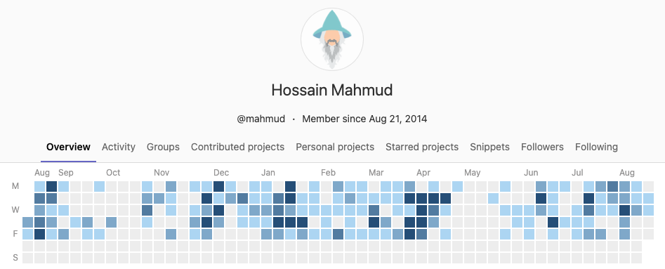

## 👋 Hello!
### Welcome to my Github!

I am a Software Engineer cum Data Scientist, currently leading the Data and Machine Learning team at Cobrainer.

  <a href="https://gitlab.com/mahmud">
     Gtilab</a>
  <a href="https://www.linkedin.com/in/hossainmahmud">
     LinkedIn</a>
  <a href="mailto:firstname dot lastname at gmail dot com">
     Email</a>

------

### 👤 Profile

Solid background of data science and machine learning. Experienced with enterprise scale agile software development, mostly data and backend services- with single command Infrastructure automation.

Contributor to pan-european open-sourced projects like Neuro-robotics platform (Python/JS), Campvis (C++/Qt). Graduated from TUM (with distinction) and BUET.

Feel free to reach out with challenging position!

------

### 📚 Stacks and 🛠️ Skills 

**Fluent** in `Python`, `C/C++/C++11`, `TypeScript`, `Git`, `SQL`, `Docker`, `Bash/Shell`, `UML`, `LATEX` \
**Data Science** with `Pandas`, `sklearn`, `scipy`, `numpy`,
`matplotlib`, `Weka`, `MOA` \
**Proficient** in `AWS Services (including CloudFormation and CDK)`, `NodeJS`, `Java`, `Prefect`, `Kafka`, `Ansible`, `CMake`, `Jira` \
**Familiar** with `C++14`, `React`, `OpenStack`, `OpenGL`, `TensorFlow`, `ROS`

**Natural languages** Bangla 🇧🇩 (native), English 🇬🇧 (native-fluent),
German 🇩🇪 (B1), Hindi 🇮🇳 & Urdu 🇵🇰 (verbal-fluent)

------

### 🧑‍💻 Experience

_Jul '21 - Present_ — **Lead Software Engineer (Data and Machine Learning)** —
Cobrainer, Munich \
  Architecting the heart-and-soul of Cobrainer's brain
  
_Jan '20 - June '21_ — **Senior Software Engineer (Recommendation)**  
Joyn, Munich \
  Developed and maintained recommendation engine to give every user a personalized experience
  
_Jan '16 - Dec '19_ — **Research Scientist** —
Fortiss GmbH, Munich \
_Jan '18 - Dec '19_ — **Senior Software Engineer (Neuro-robotics)r** — 
Human Brain Project \
_Aug '16 - Dec '17_ — **Software Engineer (Neuro-robotics)** —
Human Brain Project \
  Coordinated and developed Neuro-robotics platform

_Oct '14 - Mar '15_ — **Research Assistant (Data Science)** —
Munich Innovation Group, Munich \
  MigVis project

_Jan '15 - Dec '15_ — **Research Assistant (Software Development)** —
Fortiss GmbH, Munich \
  Ported FreeRTOS memory and thread implementation

_Nov '13 - Dec '14_ — **Research Assistant (Software Development)** —
Technical University Munich \
  CampAR project

_Apr '12 - Sep '13_ — **Software Engineer** —
Kona Software Lab, Dhaka \
  Developed Trusted Service Manager and Public Key Infrastucture for Kona I, Seoul

------
### 🎓 Education

**Master of Science in Computer Science** — 
_Technical University Munich_ —
**with Distinction**

**Bachelor of Science in Computer Science and Engineering** —
_Bangladesh University of Engineering and Technology_ —
with Merit

------

### 🤝🏼 Contact

Best way to reach me is through 📧[email](firstname dot lastname at gmail dot com) or 🔗[LinkedIn](https://www.linkedin.com/in/hossainmahmud/)
